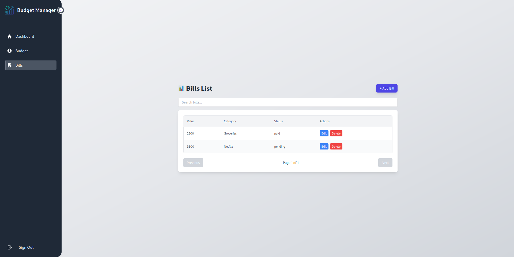
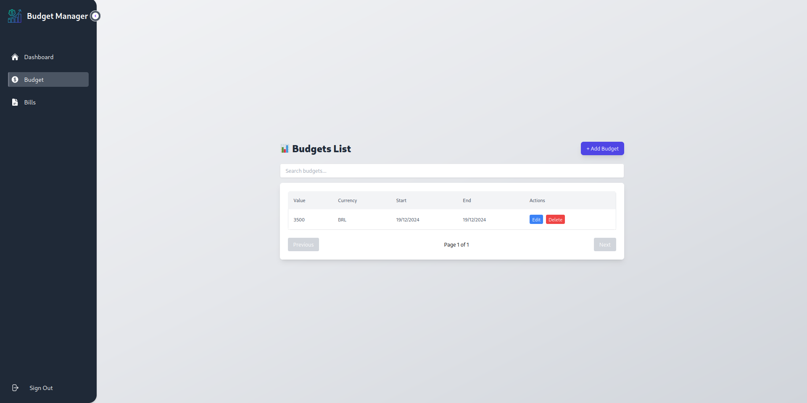
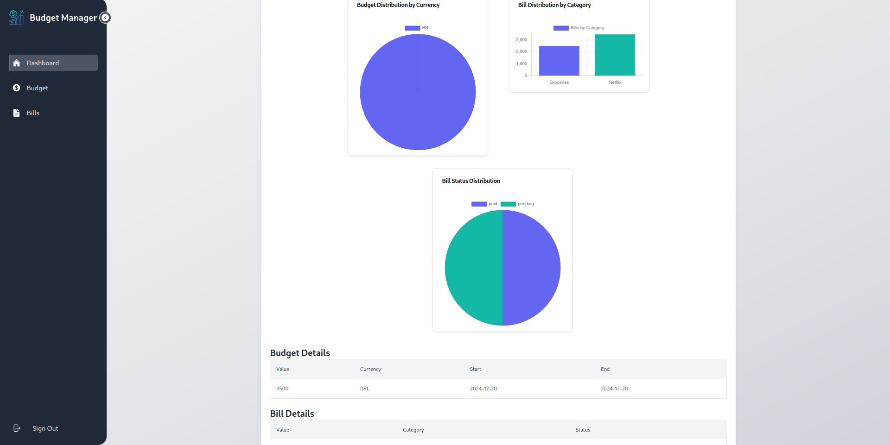

<!DOCTYPE html>
<html lang="en">
<head>
    <meta charset="UTF-8">
    <meta name="viewport" content="width=device-width, initial-scale=1.0">
</head>
<body>
    <header>
        <h1>BudgetManager</h1>
        
<strong>BudgetManager</strong> is a web application designed to help users effectively manage their budgets and track expenses. Built with React and TypeScript, the application provides an intuitive interface for creating, updating, and monitoring budgets and financial records.

    </header>

<section>
        <h2>Features</h2>
        <ul>
            <li><strong>User Authentication:</strong> Secure registration and login functionality.</li>
            <li><strong>Budget Management:</strong> Create, update, and delete budgets.</li>
            <li><strong>Expense Tracking:</strong> Log and categorize expenses.</li>
            <li><strong>Dashboard:</strong> Visualize spending and budget data.</li>
            <li><strong>API Integration:</strong> Seamlessly interacts with a backend service for data storage and retrieval.</li>
        </ul>
    </section>

<section>
        <h2>Tech Stack</h2>
        <ul>
            <li><strong>Frontend Framework:</strong> React with TypeScript</li>
            <li><strong>State Management:</strong> React Context or Redux</li>
            <li><strong>Styling:</strong> Tailwind CSS</li>
            <li><strong>API Communication:</strong> Fetch API</li>
            <li><strong>Build Tool:</strong> Vite</li>
        </ul>
    </section>

<section>
        <h2>Getting Started</h2>

<h3>Prerequisites</h3>
        <ul>
            <li>Node.js (version 16 or higher)</li>
            <li>npm or Yarn package manager</li>
        </ul>

<h3>Installation</h3>
        <ol>
            <li>
                Clone the repository:
                <pre>
git clone https://github.com/Dnreikronos/budgetMannager---Front.git
cd budgetmanager
                </pre>
            </li>
            <li>
                Install dependencies:
                <pre>npm install</pre>
            </li>
        </ol>

<h3>Running the Application</h3>
        
Start the development server:

        <pre>npm run dev</pre>
        
Visit <a href="http://localhost:5173" target="_blank">http://localhost:5173</a> in your browser.

<h3>Building for Production</h3>
        
Create an optimized production build:

        <pre>npm run build</pre>
    </section>
    <section>
        <h2>Contributing</h2>
        
Contributions are welcome! If you'd like to contribute, please fork the repository and create a pull request.

    </section>

<section>
        <h2>Contact</h2>
        
For any questions or feedback, feel free to reach out at <a href="mailto:joao.soares@universo.univates.br">joao.soares@universo.univates.br</a>.

    </section>
</body>

</html>

